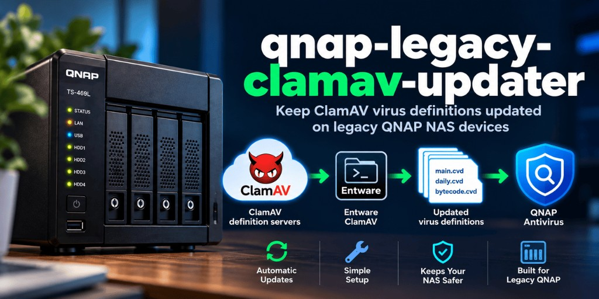

# qnap-legacy-clamav-updater



**Tested: QNAP TS-469L | QTS 4.3.4 | Entware | ClamAV 1.4.3**

Keep ClamAV virus definitions updated on legacy QNAP NAS devices using Entware ClamAV and automatic database synchronization.

> **Disclaimer:** This project is community maintained and is **not affiliated with or supported by QNAP Systems, Inc. or ClamAV / Cisco Talos**. Use at your own risk.

## What problem this solves

On some legacy QNAP systems, the built-in Antivirus application can no longer update ClamAV virus definitions. The QNAP UI may show:

```text
[Antivirus] Failed to update virus definitions.
Please try again later or update the definitions manually.
```

This project uses a current Entware ClamAV `freshclam` to download definitions, then synchronizes those databases into the directory used by QNAP Antivirus.

## Why legacy QNAP updates fail

QNAP ships a bundled ClamAV stack used by the Antivirus application. On older QTS releases, that bundled updater may no longer retrieve current definition databases reliably.

Installing a newer ClamAV through Entware alone does **not** fix the QNAP Antivirus UI, because Entware ClamAV and QNAP Antivirus use **different database directories**.

See [docs/problem.md](docs/problem.md) for details.

## Workaround architecture

```text
ClamAV definition servers
        |
        v
Entware ClamAV
        |
        | freshclam
        v
/opt/var/lib/clamav
        |
        | qnap-av-db-sync.sh
        v
QNAP Antivirus database
/share/CACHEDEV1_DATA/.antivirus/usr/share/clamav
```

Paths above are from the **tested TS-469L**. Other systems may differ. Always verify paths before installation.

More detail: [docs/how-it-works.md](docs/how-it-works.md).

## Tested hardware and software

| Item | Tested value |
|------|----------------|
| NAS | QNAP TS-469L |
| QTS | 4.3.4 (reference build 4.3.4.2814) |
| Package system | Entware |
| Entware ClamAV | 1.4.3 |

**Compatibility with other QNAP models is not claimed** unless separately verified. Other legacy QNAP systems may work if they use the same Antivirus directory layout, but you must confirm paths, ownership, and permissions on your device first.

## Requirements

- SSH access to the NAS (typically as `admin`)
- Entware installed and working
- Entware ClamAV providing `/opt/sbin/freshclam`
- QNAP Antivirus installed (so its database directory exists)
- Enough free space for ClamAV CVD files and backups

## Installation

### Automated

From a checkout of this repository on the NAS:

```sh
sh scripts/install.sh
```

The installer detects paths, shows them, asks for confirmation, backs up files it changes, installs `qnap-av-db-sync.sh` to `/opt/bin/qnap-av-db-sync.sh`, and can optionally configure persistent cron.

### Manual

Full step-by-step instructions (recommended reading even if you use the installer):

- [docs/installation.md](docs/installation.md)

Key points:

1. Install Entware ClamAV.
2. Configure `freshclam` with `DatabaseDirectory /opt/var/lib/clamav` and `DatabaseOwner admin`.
3. Run `freshclam`.
4. Install and run `scripts/qnap-av-db-sync.sh`.
5. Schedule it with QNAP’s **persistent** cron method.

## Verification

Run the read-only diagnostic script:

```sh
sh scripts/verify.sh
```

It reports model/QTS (when detectable), Entware/ClamAV status, database locations, CVD sizes/timestamps/ownership, and cron state. It does **not** modify the system or send data anywhere.

Also disable QNAP Antivirus **automatic** definition checks in Control Panel → Antivirus → Update (uncheck "Check and update automatically"). Details and screenshot: [docs/installation.md](docs/installation.md#disable-qnaps-built-in-automatic-definition-check).

## Cron configuration

Recommended schedule (daily at 03:15):

```cron
15 3 * * * /opt/bin/qnap-av-db-sync.sh >/dev/null 2>&1
```

On QNAP, do **not** rely on `crontab -e` alone. Persist the job in `/etc/config/crontab`, then reload:

```sh
crontab /etc/config/crontab && /etc/init.d/crond.sh restart
```

See [docs/installation.md](docs/installation.md) for details and Entware `crontab` PATH conflicts.

## Troubleshooting

Common issues (freshclam/`nobody` errors, permissions, cron lost after reboot, GUI still showing update failure) are covered in:

- [docs/troubleshooting.md](docs/troubleshooting.md)

Note: the QNAP Antivirus GUI may continue to report that *its own* updater failed even when this workaround is successfully maintaining the definition files on disk.

## Uninstallation

To remove the sync job and script, restore backups, and optionally keep Entware ClamAV:

- [docs/uninstall.md](docs/uninstall.md)

## Security considerations

- These scripts typically run with elevated privileges on a NAS. Review them before use.
- The installer and sync script create backups before replacing configuration or CVD files where practical.
- Ownership and permissions of existing QNAP CVD files are preserved when detectable (on the tested system this was `clamav:clamav`; do not assume that everywhere).
- Do not download or pipe remote install scripts blindly; use a reviewed checkout of this repository.
- Limit SSH access and keep Entware packages updated.

## License

MIT License. See [LICENSE](LICENSE).

## Status

Initial tree is release-ready for review. A **1.0.0** release tag should be created only after successful testing on the reference TS-469L.
