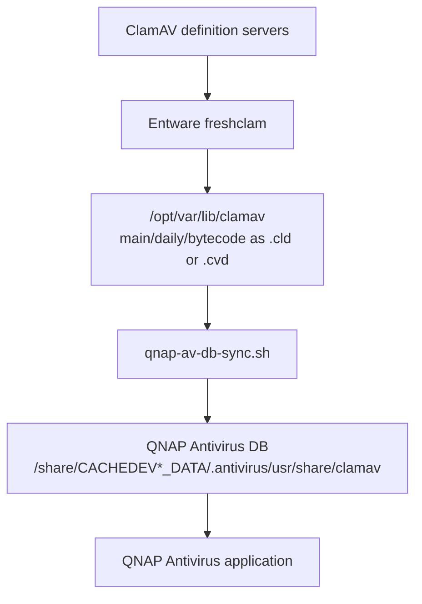

# How it works

## Pipeline

```text
freshclam
    |
    v
/opt/var/lib/clamav
    |
    v
qnap-av-db-sync.sh
    |
    v
/share/CACHEDEV1_DATA/.antivirus/usr/share/clamav
    |
    v
QNAP Antivirus
```

Paths shown are from the tested QNAP TS-469L. Detect and validate on your system before use.

## Mermaid diagram



## Step by step

1. **`freshclam` (Entware)** contacts ClamAV definition mirrors and updates database files under the Entware database directory (`DatabaseDirectory`, typically `/opt/var/lib/clamav`).
2. **`qnap-av-db-sync.sh`** resolves `main`, `daily`, and `bytecode` to whichever form freshclam left behind (`.cld` preferred when present, otherwise `.cvd`) and verifies each file is non-empty.
3. The script stages copies, backs up existing matching QNAP database files when present, then installs the new files into the QNAP Antivirus database directory.
4. **Ownership and mode** are taken from existing QNAP database files when detectable (on the tested system: `clamav:clamav`), not hard-coded blindly.
5. **QNAP Antivirus** continues to use its own database path; it does not need to call Entware `freshclam` directly.

### `.cld` vs `.cvd`

Modern ClamAV often keeps an updated `daily.cld` instead of `daily.cvd`. A sync script that only copies `*.cvd` will fail after `freshclam` even when definitions are current. This project syncs the resolved form for each database name.

If both `.cld` and `.cvd` exist in the QNAP directory, ClamAV typically prefers `.cld`. By default the sync script **moves the unused competitor aside** (renamed with a `.bak.qnap-av-db-sync` suffix) after installing the Entware file, so a stale `.cld` cannot override a newer `.cvd`. Set `DISABLE_COMPETING=no` to leave competitors untouched.

Staging uses the data volume (`/share/CACHEDEV*_DATA/tmp`) when possible, because QNAP `/tmp` is often too small for `main.cvd`.

## Why synchronization is required

| Component | Database directory (reference host) |
|-----------|--------------------------------------|
| Entware ClamAV | `/opt/var/lib/clamav` |
| QNAP Antivirus | `/share/CACHEDEV1_DATA/.antivirus/usr/share/clamav` |

Without the sync step, only Entware’s copy of the definitions is updated.

## Scheduling

A nightly cron entry runs the sync script so definitions stay current without manual intervention. On QNAP, the job must be stored in `/etc/config/crontab` and reloaded so it survives reboot. See [installation.md](installation.md).

## What this does *not* do

- It does not replace QNAP Antivirus with Entware `clamscan`.
- It does not guarantee the QNAP GUI updater will start succeeding again.
- It does not claim identical paths on unverified QNAP models.
