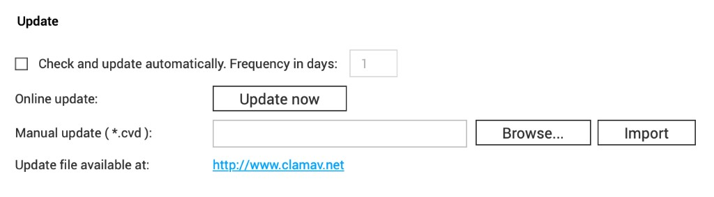

# Installation

Use `scripts/install.sh`, or follow the manual steps below.

**Tested:** QNAP TS-469L | QTS 4.3.4.2814 | Entware | ClamAV 1.4.3  
Paths are from that system — **verify on your NAS** before using them.

## Quick path (installer)

```sh
sh scripts/install.sh
```

Requires Entware + `freshclam` already present. The installer confirms paths, backs up what it changes, installs `/opt/bin/qnap-av-db-sync.sh`, and can set cron.

---

## 1. Entware (if needed)

Check:

```sh
ls -ld /opt && /opt/bin/opkg --version
```

If that fails, install Entware via App Center → **Install Manually** using the standard QPKG.  
Guide: [Entware — Install on QNAP NAS](https://github.com/Entware/Entware/wiki/Install-on-QNAP-NAS)

Remove Optware/Qnapware first. Then:

```sh
/opt/bin/opkg update
```

If `opkg` is not on `PATH`: `source /opt/etc/profile` (or call `/opt/bin/opkg` directly).

---

## 2. Entware ClamAV + freshclam

```sh
/opt/bin/opkg update
/opt/bin/opkg install clamav
mkdir -p /opt/var/lib/clamav
```

Back up, then set in `freshclam.conf` (`/opt/etc/freshclam.conf` or `/opt/etc/clamav/freshclam.conf`):

```text
DatabaseDirectory /opt/var/lib/clamav
DatabaseOwner admin
```

Example: [`config/freshclam.conf.example`](../config/freshclam.conf.example).  
`DatabaseOwner admin` avoids `nobody`-user errors seen on the reference host.

```sh
/opt/sbin/freshclam
ls -l /opt/var/lib/clamav/main.* /opt/var/lib/clamav/daily.* /opt/var/lib/clamav/bytecode.*
```

Expect `.cvd` and/or `.cld` (often `daily.cld` after updates).

---

## 3. QNAP Antivirus DB path

Reference path:

```text
/share/CACHEDEV1_DATA/.antivirus/usr/share/clamav
```

Find yours:

```sh
ls -ld /share/CACHEDEV*_DATA/.antivirus/usr/share/clamav
ls -l /share/CACHEDEV*_DATA/.antivirus/usr/share/clamav/
```

Ownership on the reference host was `clamav:clamav` — do not assume that everywhere.

---

## 4. Sync script

```sh
cp scripts/qnap-av-db-sync.sh /opt/bin/qnap-av-db-sync.sh
chmod 755 /opt/bin/qnap-av-db-sync.sh
/opt/bin/qnap-av-db-sync.sh
```

Optional overrides: `FRESHCLAM_BIN`, `ENTWARE_DB_DIR`, `QNAP_AV_DB_DIR`.

---

## 5. Cron (survives reboot)

Do **not** use `crontab -e` alone. Edit `/etc/config/crontab`, then reload:

```sh
cp -a /etc/config/crontab /etc/config/crontab.bak.$(date +%Y%m%d%H%M%S)
grep -F 'qnap-av-db-sync.sh' /etc/config/crontab || \
  echo '15 3 * * * /opt/bin/qnap-av-db-sync.sh >/dev/null 2>&1' >> /etc/config/crontab
/usr/bin/crontab /etc/config/crontab && /etc/init.d/crond.sh restart
```

If Entware’s `crontab` shadows QNAP’s, prefer `/usr/bin/crontab`.

---

## 6. Verify

```sh
sh scripts/verify.sh
```

### Disable QNAP's built-in automatic definition check

In **Antivirus → Update**, uncheck **Check and update automatically**, then save:



You do not need **Update now** or manual `*.cvd` import. If the GUI still complains about QNAP’s own updater, see [troubleshooting.md](troubleshooting.md).
